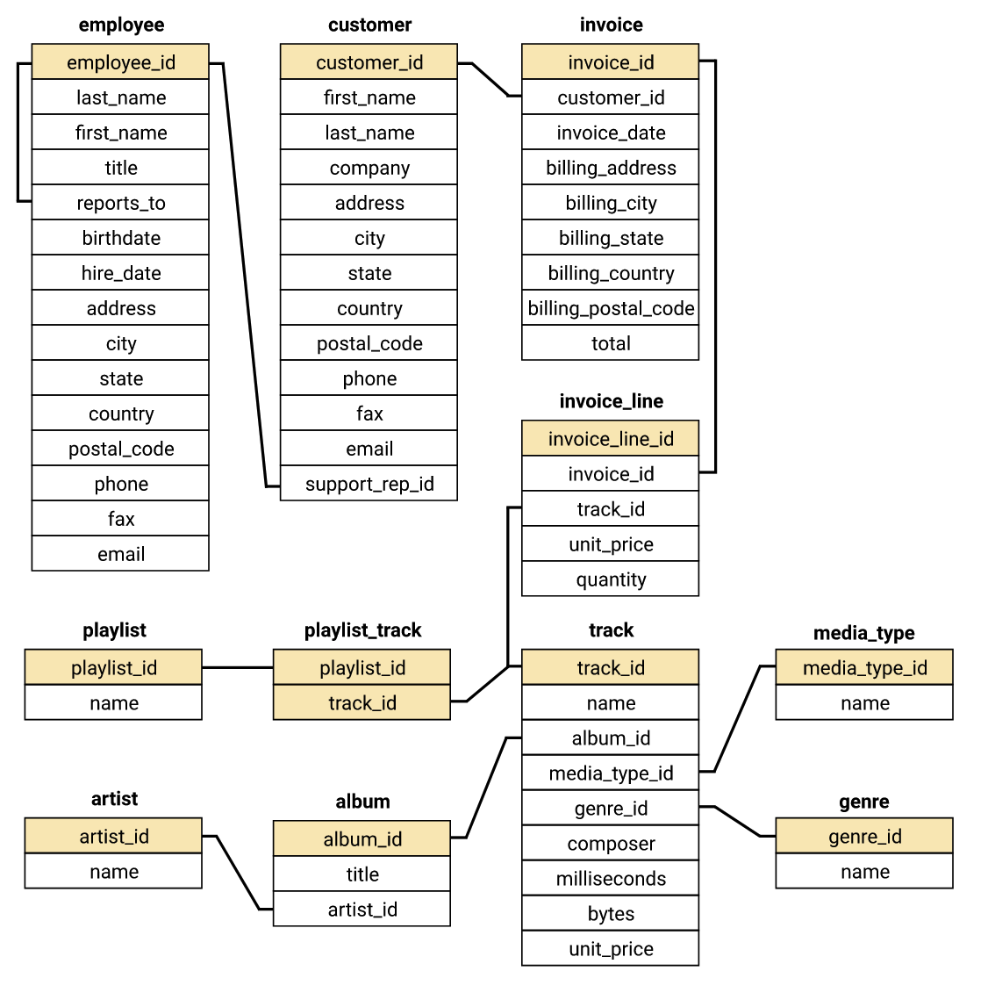
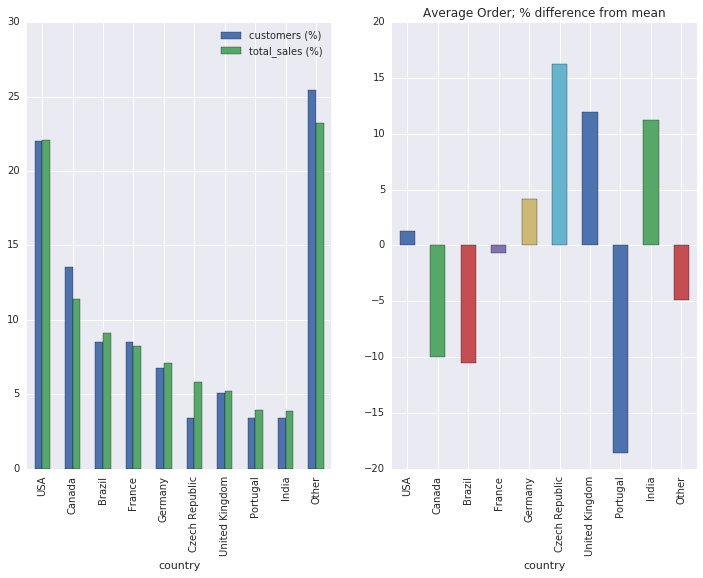

# Data Analysis for the Chinook Record Store

[Chinook](https://github.com/lerocha/chinook-database) is a sample database available for SQL Server, Oracle, MySQL, etc. It can be created by running a single SQL script. The Chinook data model represents a digital media store, including tables for artists, albums, media tracks, invoices and customers.

## Contents
- Helper Functions
- Database Schema
- Selecting Albums to Purchase
- Analyzing Employee Sales Performance
- Analyzing Sales by Country
- Summary & Additonal Questions

Here we act in the role of a data analyst tasked with answering business questions for the "Chinook Record Store" using SQL and standard python packages such as Pandas and Matplotlib.

## Database Schema

## Selecting Albums to Purchase

The Chinook record store has just signed a deal with a new record label, and we've been tasked with selecting the first three albums that will be added to the store, from a list of four. All four albums are by artists that don't have any tracks in the store right now - we have the artist names, and the genre of music they produce:

| Artist Name          | Genre   |
| -------------------- |:-------:|
| Regal                | Hip-Hop |
| Red Tone             | Punk    |
| Meteor and the Girls | Pop     |
| Slim Jim Bites       | Blues   |

The record label specializes in artists from the USA, and they have given Chinook some money to advertise the new albums in the USA, so we're interested in finding out which genres sell the best in the USA.

We will query the Chinook database to find out which genres sell the most tracks in the USA.

Alternative & Punk is the clear winner, so the artist Red Tone should be a good choice for our customers. Blues is the next contender (by a far margin from Punk), so Slim Jim Bites is the 2nd choice.

## Analyzing Employee Sales Performance

Each customer for the Chinook store gets assigned to a sales support agent within the company when they first make a purchase. We will analyze the purchases of customers belonging to each employee to see if any sales support agent is performing either better or worse than the others.

Here we can clearly see the differences in sales between the 3 employees at Chinook store. The difference in sales correlate with the difference in their hire dates (see notebook).

## Analyzing Sales by Country

Here we analyze the sales data for customers from each different country to determine which countries have potential for growth. We have been given guidance to use the country value from the customers table, and ignore the country from the billing address in the invoice table.

In particular, we have been directed to calculate data, for each country, on the:

- total number of customers
- total value of sales
- average value of sales per customer
- average order value

Note: Because there are a number of countries with only one customer, these customers will be grouped as "Other" in the analysis.

From the table and figures above we can clearly see that most of the Chinook store customers and sales orginate from the US and Canada, with a large portion of profits originating from single customers in countries spread across the globe. In additon, it appears that there are a few customers in the Czech Republic that make large purchases (large % total sales relative to % customers).  

When asking how the average order in each country from the mean of global average orders; it is revealed that there are a few countries with orders that are over 10 % greater than global orders. Based on this data, there may be opportunities in these counties:
- Czech Republic
- Unitied Kingdom
- India

Note: The amount of data used in this analysis is minimal. As such colletcting more data regarding these customers in these countries could provide more confidence in these results and should be considered before allocating resources to these markets. 

## Summary & Additional Questions

Here we utilized a sample database to peform analyses regarding genre popularity, employee performance, and global sales using SQL and python. 

In addition to the business questions above, we could answer additional business questions such as
- Which artists are most popular?
- How many tracks have been purchased vs not purchased?
- What are the characteristics of unpurchased tracks? 
- Is the range of tracks in the store reflective of their sales popularity?
- Do protected vs non-protected media types have an effect on sales?